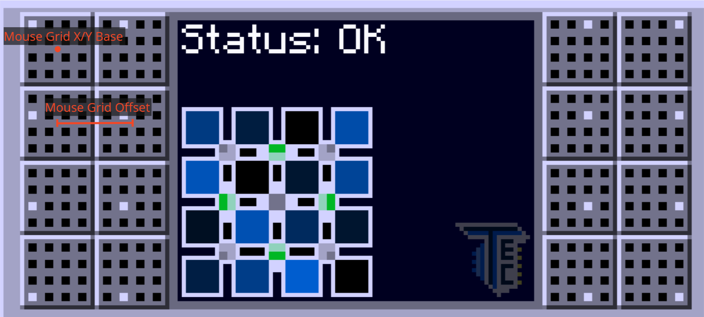

# Uncertainty Solver
Reads, solves, and inputs (using your mouse) TecTech uncertainty resolver puzzles. A simple bruteforce algorithm is
employed, either searching for a very good solution or a solution which requires minimal permutations. 

Finding a very good solution is beneficial, because this will maximize the amount of time the puzzle stays solved. 

## Program usage

### Running
Download the program from the [releases](https://github.com/tth05/uncertainty-solver/releases) section run it using 
`.\uncertainty-solver.exe [-r]`. The input values will be remembered if you run the program again. The optional `-r` 
will reset the saved values.

### Input values
These values can be ignored if "click automatically" is not used. See [disabling auto clicking](#disabling-auto-clicking)

Some parameters require screen coordinates. You can use something like ShareX or a similar program to get these values.
Where you should get these values from is shown in the image below. **Keep in mind that if you move your game window or
change your gui scale you will need new values.**

_(Example values for a 4k monitor with GUI scale "auto": x=1340, y=510, offset=145)_

### In-game usage
While in-game, use the displayed keybinding to start the solver. Holding shift will turn all lamps red (unsolve).

### Disabling auto clicking
Auto clicking can be disabled by selecting "no" for the "click automatically" option. The permutations to solve the
given pattern will always be printed and can be used to solve the puzzle manually. Simply click on the `A` square and
swap it with the `B` square. Repeat this *in the order shown* (from left to right) for each permutation in the console.

### Example Usage
https://github.com/tth05/uncertainty-solver/assets/36999320/fe919fe7-4c33-4152-a76d-af56417a75a4

## How the Uncertainty Resolver works
For each mode there are predefined groups of squares. The goal is to minimize the color difference for all squares in
a group. Note that the normal resolver uses blinking speed instead of a color to display the value of a cell.
Initially, all squares are assigned a random value from the range [0, 999].

_(Groups are marked with the same number)_
